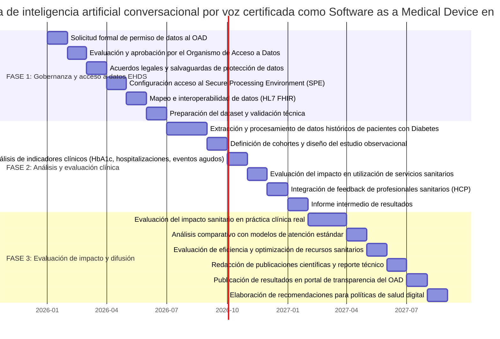

# **Proyecto de Transformación Digital en el Espacio Europeo de Datos de Salud** 

## **Optimización del seguimiento de la diabetes mediante una plataforma de IA de Voz (Voice AI) certificada como SaMD**.   
### _(Proyecto de Uso Secundario de Datos EEDS)_

---

## SECCIÓN 1: Contexto y Problema 

### Mi rol y situación actual: 

Actúo como **Investigadora privada e innovadora** **tecnológica** en una startup europea de salud digital. Mi rol es el de **usuario de datos** (Art. 61\) que busca generar evidencia científica sobre el impacto de herramientas de IA en la salud pública.

### El problema identificado: 

El seguimiento de la diabetes requiere una monitorización continua para evitar descompensaciones. Las herramientas actuales a menudo carecen de la capacidad de interactuar de forma natural con el paciente. Nuestra plataforma de **Voice AI** puede resolver esto, pero para ajustarse al usuario final y ser segura, necesita entrenarse con una **muestra diversa y representativa** de datos reales que los entornos de laboratorio no pueden proporcionar.

### Cómo el EEDS es la solución: 

El Reglamento EEDS permite a los **innovadores privados** acceder a datos seudonimizados para la **evaluación del rendimiento del sistema sanitario (Art. 53.1.b)** y para asegurar que la tecnología sanitaria contribuya al **beneficio público**. El acceso masivo y estandarizado a través de un **Organismo de Acceso a Datos (OAD)** nos permite evaluar la eficacia de la herramienta sin necesidad de entrenar algoritmos, centrándonos exclusivamente en el **impacto de su implementación.**

Bajo el marco del **uso secundario**, podemos acceder a registros históricos de forma estandarizada a través de un **Organismo de Acceso a Datos (OAD)**, garantizando que nuestra **tecnología contribuya al beneficio público y a la mejora de la tecnología sanitaria**.

## SECCIÓN 2: Derechos y Deberes 

### A) Derechos del Paciente

Los **seis derechos principales** de los interesados (pacientes) se encuentran recogidos en el **Capítulo III del RGPD (Artículos 12 al 22\)**. En el marco del proyecto de evaluación de la telemedicina en el Hospital Universitario Cruces, se aplicarían de la siguiente manera:

1. **Derecho de Transparencia e Información (Artículos 13 y 14):** El paciente tiene derecho a recibir información concisa, transparente e inteligible sobre quién trata sus datos y para qué.  
   * *Aplicación:* Se informará de forma clara, el **paciente sabrá de forma clara que su información contribuye a evaluar el impacto de la implementación de la IA** para mejorar el manejo de su enfermedad; se especificará que **no es para entrenamiento**, sino para medir la efectividad clínica  
2. **Derecho de Acceso (Artículo 15):** El paciente tiene derecho a obtener confirmación de si se están tratando sus datos y acceder a detalles como los fines del tratamiento o el plazo de conservación.  
   * *Aplicación:* el paciente podrá verificar si sus registros de consultas virtuales en están incluidos en el estudio de impacto asistencial.  
3. **Derecho de Rectificación (Artículo 16):** Derecho a que se corrijan sin dilación los datos personales inexactos o se completen los que estén incompletos.  
   * *Aplicación:* Si se detectara un error, el paciente podrá solicitar su subsanación en el nodo origen de Osakidetza.  
4. **Derecho de Supresión o "Derecho al Olvido" (Artículo 17):** Derecho a obtener la eliminación de sus datos cuando, entre otros motivos, ya no sean necesarios para los fines recogidos o el interesado retire su consentimiento.  
   * *Aplicación:* Si un paciente decide que sus datos dejen de formar parte de la serie histórica de 5 años utilizada, estos deberán ser suprimidos de la base del estudio.  
5. **Derecho a la Limitación del Tratamiento (Artículo 18):** Derecho a que los datos no se utilicen, pero se conserven, bajo condiciones específicas como la impugnación de su exactitud.  
   * *Aplicación:* El paciente podrá solicitar que sus datos de se mantengan bloqueados para la investigación mientras se verifica la veracidad de los indicadores de reingreso registrados.  
6. **Derecho a la Portabilidad de los Datos (Artículo 20):** Derecho a recibir sus datos en un formato estructurado, de uso común y lectura mecánica, y a transmitirlos a otro responsable.  
   * *Aplicación:* Gracias al uso del estándar **HL7 FHIR**, el paciente podrá ejercer este derecho de forma efectiva (ej. mediante el "Yellow Button"), facilitando que sus datos clínicos de Cruces viajen de forma segura a otros centros de la UE si así lo desea.

### B) Fines Permitidos vs. Prohibidos 

Dado que este proyecto involucra el **uso secundario** de datos sanitarios electrónicos, se rige por el Reglamento del EEDS:

* **Fines Permitidos:** La investigación persigue la **mejora de la prestación sanitaria** (Art. 53.1.f) y el **apoyo a políticas públicas sanitarias** mediante la evaluación del rendimiento del sistema (Art. 53.1.b), siempre contribuyendo al **beneficio público o tecnología sanitaria.**  
* **Fines Prohibidos:** Se prohíbe explícitamente cualquier intento de **reidentificación** de los pacientes (Art. 54.1.d). Queda prohibida la comercialización directa o el uso para marketing hacia el paciente. Asimismo, los resultados nunca podrán ser utilizados para tomar decisiones que afecten a las primas de seguros o condiciones laborales de los pacientes (Art. 54.1.a, b).

### C) Principios de Protección de Datos 

Los **seis principios fundamentales** que rigen cualquier tratamiento de datos personales se encuentran establecidos en el **Artículo 5 del Reglamento (UE) 2016/679 (RGPD)**. Estos son:

1. **Licitud, lealtad y transparencia:** Los datos deben ser tratados de forma legal y clara para el interesado.  
2. **Limitación de la finalidad:** Los datos se recogen con fines determinados, explícitos y legítimos.  
3. **Minimización de datos:** Los datos deben ser adecuados, pertinentes y limitados a lo necesario.  
4. **Exactitud:** Los datos deben estar actualizados y ser exactos.  
5. **Limitación del plazo de conservación:** No se mantienen más tiempo del necesario para los fines del tratamiento.  
6. **Integridad y confidencialidad:** Se debe garantizar una seguridad adecuada mediante medidas técnicas u organizativas.

#### Aplicación en el proyecto: 

1. **Minimización de datos (Art. 5.1c):** Solo se solicitan las variables estrictamente necesarias para el análisis estadístico (como el tipo de consulta y el diagnóstico codificado), excluyendo cualquier identificador directo como nombres o DNI.  
   En la solicitud al OAD, solo se han incluido variables estrictamente necesarias para el análisis estadístico, eliminando cualquier identificador directo como nombres o DNI para reducir riesgos de privacidad  
2. **Integridad y Confidencialidad (Art. 5.1f):** Los datos se tratarán en un **Entorno Seguro de Procesamiento (SPE/ETS)** que impide la descarga de microdatos y garantiza que solo usuarios autorizados accedan a la información bajo supervisión técnica.

### D) Derecho de Autoexclusión (Opt-out) 

Se respetará el derecho del paciente a oponerse al tratamiento de sus datos de salud para fines de investigación (uso secundario) de forma sencilla. El sistema de Osakidetza integrará un mecanismo donde el ciudadano pueda ejercer su **autoexclusión** por defecto.

* **Excepciones:** Este derecho de veto podría verse limitado en casos de **interés público esencial**, como la protección frente a amenazas transfronterizas graves para la salud o emergencias sanitarias declaradas.

### E) Mecanismos de Auditoría y Confianza 

Para garantizar la confianza, se implementarán **registros de acceso** detallados. Cada vez que un investigador del IISD acceda a un conjunto de datos en el entorno seguro, quedará una traza inalterable de "quién, cuándo y para qué".

* **Supervisión:** El **Organismo de Acceso a Datos (OAD)** será el encargado de monitorear y auditar estas actividades, pudiendo imponer sanciones si detecta usos no autorizados o sospechosos.

### F) Consentimiento e Información al Paciente 

Se informará a los pacientes de forma transparente sobre el valor social de su información.

#### Párrafo explicativo para pacientes: 

*"“En el Hospital Universitario Cruces estamos trabajando para mejorar el seguimiento de personas con Diabetes Mellitus mediante herramientas digitales que ayudan a reforzar la comunicación entre pacientes y profesionales sanitarios.*

*Para evaluar si estas soluciones mejoran la atención sanitaria, analizamos datos clínicos de forma segura y sin incluir información que permita identificarte directamente. Estos datos se estudian junto con los de otros pacientes para comprender mejor cómo las nuevas tecnologías pueden ayudar a mejorar el control de la enfermedad y la calidad de la atención.*

*Tienes derecho a solicitar que tus datos no se utilicen en este tipo de estudios de mejora del sistema sanitario. Esta decisión no afectará en ningún caso a la atención médica que recibas.”*

## SECCIÓN 3: Tecnología, Estándares y Seguridad 

### A) Estándares Técnicos 

El proyecto se basa en una plataforma con **rigor de dispositivo médico**:

#### **A.1. Certificación**

CE-marked **Software as a Medical Device (SaMD)** con un sistema de calidad basado en **ISO 13485**.

#### **A.2. Interoperabilidad**

Para este proyecto, el estándar fundamental de interoperabilidad es **HL7 FHIR (v5.0.0)**. Se utilizará porque permite estructurar la información clínica de forma semánticamente coherente, facilitando que los datos del Servicio Vasco de Salud sean entendidos en todo el ecosistema del EEDS.

#### Mapeo de variables aplicadas:

Para asegurar una evaluación precisa del impacto sanitario, se aplicará el siguiente mapeo de recursos FHIR:

* **Identificación del Sujeto:** Se empleará el recurso **Patient.identifier** para gestionar el identificador seudonimizado del paciente, garantizando la privacidad y el seguimiento longitudinal sin revelar la identidad real.  
* **Diferenciación de Episodios:** Las interacciones de la plataforma de IA de Voz frente a las visitas presenciales se clasificarán mediante el elemento **Encounter.class**, permitiendo comparar la eficacia del seguimiento remoto. Además, se utilizará **Encounter.hospitalization** como indicador de complicaciones agudas.  
* **Codificación Clínica de Precisión:** Los diagnósticos se extraerán del recurso **Condition.code** utilizando la codificación **ICD-11**. Este nivel de detalle es esencial para categorizar correctamente los tipos de diabetes y sus complicaciones asociadas.  
* **Parámetros de Seguimiento Metabólico:** Se utilizará el recurso **Observation.value** para capturar variables críticas como los niveles de hemoglobina glicosilada (HbA1c) y los registros de glucosa, fundamentales para evaluar la mejora en el control de la enfermedad.  
* **Tratamiento Farmacológico:** Las prescripciones se mapearán mediante **MedicationStatement.medication**, permitiendo analizar la adherencia y cambios en el tratamiento tras la implementación de la IA.

Este enfoque de historias clínicas interoperables se alinea con los modelos de éxito promovidos por iniciativas europeas como **xShare** (fomentando el intercambio de datos) y la red **UNICAS** (basada en infraestructuras federadas), asegurando que el dispositivo médico opere bajo los más altos estándares de calidad y rigor técnico

### B) Modelo de Implementación 

Se opta por un **modelo federado**, siguiendo la arquitectura de proyectos insignia como **EUCAIM** y la **Red UNICAS**.

* **¿Por qué este modelo?** Bajo el lema **"que viajen los datos y no los pacientes"**, este modelo permite que la información original permanezca en los servidores de Osakidetza. Solo se comparten resultados agregados o copias seudonimizadas necesarias para el análisis.  
* **Ventajas:** Garantiza la **soberanía de los datos** del hospital y reduce los riesgos de seguridad masiva al evitar una base de datos centralizada.  
* **Desafíos:** Requiere una alta coordinación técnica para asegurar que todos los nodos utilicen los mismos estándares de calidad y metadatos (principios **FAIR**).

#### Tabla Diferencia: Modelo Federado vs. Modelo Centralizado 

| Característica | Modelo Federado (Ej. EUCAIM / UNICAS) | Modelo Centralizado (Enfoque tradicional) |
| ----- | ----- | ----- |
| **Ubicación de los datos** | Los datos permanecen en los servidores locales (hospitales o nodos de origen). | Los datos se recolectan y almacenan en un único repositorio o base de datos central. |
| **Movimiento de información** | **"Viajan los algoritmos/consultas, no los datos"**. El conocimiento se adquiere en el nodo y solo regresa el resultado. | Los datos individuales viajan desde el origen hasta el centro para ser procesados. |
| **Soberanía y Privacidad** | Mayor control local. Se reducen los riesgos de seguridad al evitar grandes transferencias de datos sensibles. | La responsabilidad de la seguridad se concentra en el administrador del repositorio central. |
| **Escalabilidad** | Permite conectar un gran número de socios (ej. 95 en EUCAIM o 30 hospitales en UNICAS) manteniendo la autonomía local. | Puede presentar cuellos de botella técnicos y administrativos al gestionar permisos masivos de carga de datos. |

### C) Entornos Seguros de Procesamiento (SPE/ETS) 

Para garantizar la seguridad en el acceso a datos sensibles (registros de diagnósticos y reingresos), el análisis se realizará exclusivamente en un **Entorno de Tratamiento Seguro (ETS)** supervisado por el Organismo de Acceso a Datos.

#### Medidas técnicas implementadas: 

1. **Laboratorios virtuales:** Los investigadores del IISD accederán mediante **autenticación de doble factor** a una infraestructura protegida donde no es posible la descarga de microdatos individuales.  
2. **Seudonimización robusta:** Se aplicará el tratamiento de datos de modo que no puedan atribuirse a un interesado sin información adicional que se mantiene por separado (Art. 4.5 RGPD).  
3. **Auditoría y control:** Cada acción dentro del entorno quedará registrada para fines de auditoría, permitiendo al OAD verificar quién accedió a qué datos y para qué fin autorizado.  
4. **Anonimización de salida:** Solo se permitirá la extracción de resultados estadísticos que hayan superado técnicas de anonimización para evitar la reidentificación residual.

### D) Referencia a Casos de Éxito

Se han seleccionado dos proyectos clave del Módulo 4 para adaptar sus lecciones al entorno de Cruces:

* **Proyecto xShare:** De esta iniciativa se adopta la estrategia **"solo una vez"**. El objetivo es que los datos registrados durante la teleconsulta asistencial se conviertan automáticamente en un activo interoperable para la investigación, reduciendo la carga administrativa para el personal de Osakidetza.  
* **Proyecto UNICAS:** De este caso se adapta el modelo de **gobernanza compartida** y la infraestructura federada. Se implementará un nodo de interoperabilidad en el hospital que permita realizar consultas sobre cohortes de pacientes de telemedicina sin comprometer su privacidad, siguiendo el éxito de este proyecto en el sistema sanitario español. 

## SECCIÓN 4: Gobernanza, Actores y OADs. 

### A) Niveles de Gobernanza 

El proyecto opera en una estructura **multinivel coordinada**, asegurando que el dato fluya de forma legal y segura desde el hospital hasta el investigador.

| Nivel | Proyecto |
| ----- | ----- |
| **Local** (Hospital / Osakidetza) | **Tenedor de datos:** El Servicio Vasco de Salud (Osakidetza) custodia las historias clínicas electrónicas.  **Roles:** El personal administrativo y de IT se encarga de catalogar los metadatos y asegurar la calidad del dato en el nodo origen. |
| **Nacional** (OAD) | **Evaluador y Garante:** Se interactúa con el Organismo de Acceso a Datos (España) mediante la presentación de la solicitud formal de permiso. El OAD evalúa la minimización, emite el permiso vinculante y supervisa el análisis en el Entorno Seguro. |
| **Europeo** (EHDS Board) | **Coordinador Normativo:** Asegura que los estándares **HL7 FHIR** aplicados en Cruces sean interoperables transfronterizamente. Los resultados del impacto de la telemedicina pueden informar políticas sanitarias a nivel de la Unión Europea. |

### B) Rol del OAD (Organismo de Acceso a Datos) 

Se **solicitaría al OAD** acceso a un conjunto de **datos sanitarios electrónicos seudonimizados** correspondientes a los encuentros clínicos de los últimos cinco años en el Hospital Cruces.   
Las variables incluyen identificadores seudonimizados (**PatientID**, **EncounterID**), fechas de visita, tipo de consulta (presencial vs. virtual), diagnósticos codificados en **ICD-11** e indicadores de reingreso.  
**Criterios de evaluación que debe aplicar el OAD:**

1. **Finalidad:** Comprobar que el uso persigue fines permitidos (Art. 53), como la **mejora de la prestación sanitaria, evaluación del rendimiento y  evaluación de impacto sanitario. Beneficio para salud pública o sistema sanitario europeo.**  
2. **Minimización:** Verificar que las variables solicitadas son las estrictamente necesarias y que no se piden datos identificativos directos.  
3. **Seguridad:** Validar que el solicitante trabajará en un **Entorno Seguro de Procesamiento (SPE/ETS)** que impida la descarga de microdatos.

#### Párrafo de solicitud simulada al OAD: 

*"Solicitamos acceso a datos seudonimizados de pacientes con diabetes para la **evaluación del impacto sanitario** de una plataforma de Voice AI certificada como SaMD (MDR Class IIb). El propósito es generar **evidencia en vida real (real-world evidence)** sobre cómo esta herramienta optimiza la monitorización y reduce episodios agudos (Art. 53.1.b/f). No se utilizarán datos para entrenamiento algorítmico. Se trabajará bajo supervisión humana en un **SPE**, respetando la prohibición de reidentificación y publicando los resultados por transparencia"*

### C) Actores Involucrados 

* **Tenedores de datos:** Servicio Vasco de Salud (Osakidetza), responsable de la custodia y calidad de la información original.  
* **Usuarios de datos:** Investigadores del **Instituto de Investigación en Salud Digital (IISD)** de la UPV/EHU, quienes analizan el dato para generar conocimiento.  
* **Pacientes:** Ciudadanos que ejercen sus derechos de acceso y portabilidad, y el derecho de **autoexclusión (opt-out)** si no desean que sus datos se usen para este fin.  
* **Autoridades regulatorias:** El Organismo de Acceso a Datos nacional (evaluador) y la Junta del EEDS (coordinador europeo).

### D) Confianza y Transparencia 

1. #### Construcción de confianza con pacientes: 

   Para construir **confianza y asegurar la transparencia** con los pacientes del Hospital Universitario Cruces en el marco de este proyecto de transformación digital, se implementarían las siguientes estrategias basadas en los estándares del EEDS y el RGPD:  
* **Garantía del Derecho de Autoexclusión (Opt-out):** Se comunicará de forma clara y sencilla que, bajo el nuevo paradigma del EEDS, los pacientes tienen el **poder de veto** sobre el uso secundario de sus datos. Se facilitará un mecanismo de **"un solo clic"** en el portal de salud de Osakidetza para que cualquier ciudadano pueda oponerse al tratamiento de sus registros de telemedicina para fines de investigación, sin que ello afecte en absoluto a su calidad asistencial.  
* **Transparencia Proactiva a través del OAD:** Cumpliendo con el Reglamento, la información pública del proyecto (título, líder y propósito) se publicará en el sitio web del **Organismo de Acceso a Datos (OAD)** en un plazo de 30 días tras recibir el permiso. Además, me comprometo legalmente a **hacer públicos los resultados** finales en un plazo no superior a 18 meses tras el procesamiento, permitiendo que la sociedad vea el valor real que sus datos han aportado a la mejora del hospital.  
* **Comunicación del Uso de Entornos Seguros:** Se informará a los pacientes sobre el uso de **Entornos Seguros de Procesamiento (SPE/ETS)**. La confianza se refuerza al explicar que sus microdatos **nunca salen de la infraestructura protegida**, que está estrictamente prohibida la descarga de información individual y que existe una **garantía contractual contra la reidentificación** que acarrea sanciones severas en caso de incumplimiento.  
* **Empoderamiento mediante el Yellow Button:** Siguiendo el modelo del proyecto **xShare**, se promoverá que los pacientes utilicen herramientas de portabilidad para gestionar sus propios datos de teleconsultas. Al ver que el sistema les permite compartir sus propios datos de forma segura, se rompe la percepción del dato como algo oculto y se fomenta una cultura de **colaboración ciudadana**.  
* **Involucración de los Profesionales como Embajadores:** La metodología incluye **cuestionarios a profesionales sanitarios (HCP)** para evaluar la utilidad clínica de las soluciones de seguimiento digital basadas en inteligencia artificial.  
  Esta combinación de **control ciudadano, seguridad técnica y transparencia en los resultados** es la base para transformar el "dato estático" en un activo social que cuente con el respaldo de la población.

2. #### Mecanismos de transparencia:  

* El resumen público del proyecto será accesible en el portal del OAD.  
* Además, existe la obligación legal de publicar los resultados finales de la investigación en un plazo de **18 meses** tras finalizar el análisis.   
* Y se informará al OAD sobre el número de publicaciones científicas y documentos de políticas sanitarias generados.

3. #### Comunicación con profesionales sanitarios:  

* **Metodología Híbrida:** Para asegurar que la digitalización se perciba como una herramienta de apoyo y no como una carga administrativa, el proyecto integrará a los médicos y enfermeras mediante **cuestionarios (HCP)** dirigidos a evaluar la utilidad clínica de las soluciones de seguimiento digital basadas en inteligencia artificial.

* **Feedback Directo:** Estos datos primarios se recogerán fuera del acceso del OAD, garantizando la ética y confidencialidad, y permitiendo que los profesionales influyan en la optimización de los protocolos del hospital basados en su experiencia real.

## SECCIÓN 5: Impacto, Beneficios y Retos Futuros

El objetivo fundamental de este proyecto es generar **evidencia en vida real (Real-World Evidence)** sobre cómo la implementación de una plataforma de **inteligencia artificial conversacional por voz** (certificada como **SaMD**) optimiza el seguimiento clínico de pacientes con **Diabetes Mellitus**, mejorando la sostenibilidad del sistema sanitario y la calidad de vida del paciente crónico.

### A) Beneficios Esperados

* **Para pacientes:** Mejora del control metabólico y reducción de episodios agudos (como hipoglucemias graves) gracias a un seguimiento remoto más humano y proactivo. Se fomenta el **empoderamiento** mediante la portabilidad de sus datos bajo el estándar **HL7 FHIR**, permitiéndoles ser dueños de su historial de seguimiento digital.  
* **Para profesionales sanitarios:** Validación de la **utilidad y satisfacción** de la IA mediante **cuestionarios (HCP)**, asegurando que la herramienta actúe como un apoyo en la detección temprana de descompensaciones sin aumentar la carga administrativa del médico.  
* **Para investigadores e innovadores:** Acceso a una **ventana temporal de 5 años** de datos seudonimizados y representativos, permitiendo evaluar el rendimiento del dispositivo médico en diversas poblaciones, evitando sesgos y asegurando que la tecnología se ajuste a las necesidades reales del sistema público.  
* **Para la sociedad:** Contribución al **interés público** mediante el desarrollo de tecnología sanitaria segura y eficiente. Se estima que la implementación validada de estas herramientas puede reducir los costes por ingresos hospitalarios evitables y optimizar la planificación de recursos en el sistema sanitario regional.

### B) Desafíos Anticipados y Abordaje 

* **Técnicos (Interoperabilidad):** La fragmentación de datos entre niveles asistenciales y dispositivos.  
  * **Abordaje:** Uso obligatorio de **HL7 FHIR (v5.0.0)** y codificación **ICD-11** para asegurar que los resultados de la evaluación sean comparables y reutilizables en todo el **EEDS**.  
* **Organizacionales:** Percepción de la IA como una "caja negra" o carga adicional.  
  * **Abordaje:** Integrar a los profesionales de Cruces mediante la **metodología híbrida** (encuestas HCP) para recoger feedback directo sobre la utilidad clínica fuera del entorno del OAD.  
* **Legales:** Cumplimiento de las obligaciones del usuario de datos privado según el **Artículo 61**.  
  * **Abordaje:** Actuar bajo la supervisión del **Organismo de Acceso a Datos (OAD)**, respetando la prohibición absoluta de reidentificación y limitando el uso estrictamente a los fines de evaluación autorizados.  
* **Éticos (Privacidad y Sesgo):** Riesgos derivados de la comercialización de productos sanitarios.  
  * **Abordaje:** Uso de **Entornos Seguros de Procesamiento (SPE/ETS)** y garantía de que el testeo con pacientes sea gestionado exclusivamente por el hospital tenedor de los datos, nunca por la empresa privada directamente.

### C) Indicadores de Éxito (KPIs)

Para medir el impacto de la implementación de la Voice AI en el Hospital Universitario Cruces, se establecen los siguientes indicadores:

1. **Reducción del 10-15% en hospitalizaciones relacionadas con diabetes:** Medido a través del recurso `Encounter.hospitalization` en la cohorte que utiliza la plataforma de IA.  
2. **95% de éxito en la interoperabilidad semántica:** Porcentaje de variables clínicas (glucosa, HbA1c, medicación) correctamente mapeadas a recursos FHIR para la evaluación.  
3. **Tasa de autoexclusión (opt-out) inferior al 10%:** Reflejo de la confianza del paciente en el sistema de transparencia y seguridad del proyecto.  
4. **Publicación de resultados en \<18 meses:** Difusión obligatoria de los hallazgos de la investigación en el portal de transparencia del OAD para contribuir al conocimiento público, conforme a las obligaciones de transparencia del **Artículo 61**.

### D) Timeline 

Se propone una cronología de 18 meses, alineada con los plazos de respuesta del Organismo de Acceso a Datos (OAD) y la obligación de publicar resultados.

Figura: Timeline Proyecto Evaluación del impacto sanitario de una plataforma de inteligencia artificial conversacional por voz certificada como Software as a Medical Device en el seguimiento de pacientes con Diabetes Mellitus.

### E) Reflexión Personal 

* #### ¿Qué no sabía antes de este curso que sé ahora? 

  Antes de esta formación, desconocía el funcionamiento técnico de los **Entornos Seguros de Procesamiento (SPE/ETS)**. Como innovadora en el sector privado, pensaba que el acceso a datos implicaba una transferencia de archivos a nuestros servidores locales, pero ahora entiendo el concepto de **"viajar los algoritmos y no los datos"**. He comprendido que el investigador trabaja en un laboratorio virtual supervisado donde no existe posibilidad de descarga de microdatos, lo cual es la clave para que la industria privada pueda evaluar sus tecnologías sin comprometer la privacidad. También ignoraba la importancia del **derecho de autoexclusión (opt-out)** supervisado por el **OAD**; ahora entiendo que este mecanismo es el que legitima nuestra actividad ante el ciudadano, ofreciendo una alternativa ética al consentimiento fragmentado.

* #### ¿Cuál fue el módulo más valioso y por qué?  

  El **Módulo 3 (Uso Secundario)** ha sido el más valioso por las siguientes razones:  
* **Cambio de Paradigma:** Este módulo define con claridad que el dato de salud deja de ser un registro estático de una consulta para transformarse en un **activo de valor social**. Esto permite que la información pueda "reciclarse" con el fin de generar **evidencia en vida real (Real-World Evidence)**, algo fundamental para evaluar el impacto de un dispositivo médico.  
* **Seguridad Jurídica (Artículos 53 y 54):** La distinción entre los **fines permitidos** (como la mejora de la tecnología sanitaria en el **Art. 53.1.c** y la evaluación del rendimiento del sistema en el **Art. 53.1.b**) y los **fines prohibidos** (como el marketing o la toma de decisiones sobre seguros en el **Art. 54**) aporta la confianza necesaria para operar en el ecosistema digital europeo. Para una startup, esta estructura de "listas blancas y negras" elimina barreras burocráticas que antes parecían insalvables.  
* **Obligaciones y Transparencia (Artículo 61):** El módulo destaca que los **usuarios de datos** tenemos responsabilidades estrictas, como respetar la prohibición de reidentificación y la **obligación de hacer públicos los resultados** de nuestras investigaciones. Estos deberes son esenciales para transformar la innovación privada en un beneficio tangible y transparente para la salud pública.  
* **Protección de Datos en Acción:** Permite comprender cómo el principio de **minimización (Art. 5.1.c del RGPD)** y el uso de **Entornos Seguros de Procesamiento (SPE/ETS)** garantizan que la innovación tecnológica no comprometa la privacidad del paciente.  
  En resumen, el Módulo 3 proporciona el **marco legal y ético** que permite a **agentes privados** participar en el EEDS, asegurando que su actividad contribuya directamente al **beneficio del sistema sanitario europeo**.

* #### ¿Cómo cambió mi perspectiva sobre los datos de salud y su regulación?

  Mi visión ha evolucionado de percibir la protección de datos como un obstáculo necesario para la innovación privada a verla como su **principal facilitador**. El EEDS demuestra que la privacidad y la investigación industrial no son conceptos opuestos, sino que se equilibran mediante la gobernanza de los **OAD** y las obligaciones del **Artículo 61**. La regulación de la UE no busca restringir el acceso a los innovadores, sino darle fluidez bajo condiciones de **transparencia y ética**, permitiendo que empresas privadas colaboren con sistemas públicos como Osakidetza para liderar la transformación digital en beneficio real del paciente.

## REFERENCIAS 

1. **Reglamento (UE) 2025/327** del Parlamento Europeo y del Consejo, de 11 de febrero de 2025, sobre el Espacio Europeo de Datos de Salud (EEDS).  
2. **Reglamento (UE) 2016/679** del Parlamento Europeo y del Consejo, de 27 de abril de 2016, relativo a la protección de las personas físicas en lo que respecta al tratamiento de datos personales y a la libre circulación de estos datos (RGPD).  
3. **Módulo 3: Uso Secundario, fines, prohibiciones y organismos de acceso a datos.** Microcredencial CSIC \- Espacio Europeo de Datos de Salud.  
4. **Módulo 4: Casos de Éxito y Proyectos de Implementación del Espacio Europeo de Datos de Salud.** Microcredencial CSIC \- Espacio Europeo de Datos de Salud.  
5. **Proyecto OHSIRIS:** Infraestructura federada de datos para investigación clínica en España liderada por el Hospital Virgen Macarena.  
6. **Proyecto UNICAS:** Red federada de 30 hospitales para la atención y análisis de datos de enfermedades raras pediátricas.  
7. **Proyecto xShare:** Iniciativa para facilitar el intercambio de datos mediante el formato europeo EEHRxF y la innovación del "Yellow Button".  
8. **EUCAIM (European Cancer Imaging Initiative):** Proyecto insignia para el aprendizaje federado aplicado a imágenes oncológicas en toda Europa.  
9. **TEHDAS (Towards the European Health Data Space):** Acción conjunta para definir las guías de implementación técnica y gobernanza del EEDS.  
10. **Estándares HL7 FHIR (Fast Healthcare Interoperability Resources):** Guías de implementación técnica v5.0.0 utilizadas para garantizar la interoperabilidad semántica del dato asistencial.

## ANEXO

### **Rigor como dispositivo médico**

La solución se comercializa como **Software as a Medical Device (SaMD)** con **marcado CE**, desarrollada bajo un **Sistema de Gestión de Calidad conforme a la norma ISO 13485**, lo que garantiza trazabilidad, control de riesgos y cumplimiento de los requisitos regulatorios aplicables a dispositivos médicos.

### **Gobernanza y responsabilidad en IA**

La empresa aplica un marco de **gobernanza de inteligencia artificial responsable**, alineado con el estándar BS 30440 para la gestión de riesgos en sistemas de IA, y se está preparando de forma proactiva para cumplir con el futuro **marco regulatorio europeo de IA**, el EU AI Act.

### **Seguridad y protección de datos**

La plataforma garantiza la protección de la información mediante controles de seguridad avanzados y un sistema de gestión de seguridad de la información certificado según ISO/IEC 27001, además de cumplir con los requisitos de auditoría y control establecidos por **SOC 2**.
